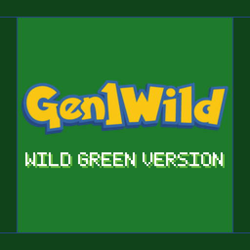

<p align="center">
  <a href="https://wild1walker.github.io/Gen1Wild/"></a>
</p>

<p align="center">
  <b>A personal mod index for <a href="https://github.com/bryanthaboi/gen1recomp">gen1recomp</a></b><br>
  The mods I maintain, one link, updates picked up on their own.
</p>

<p align="center">
  <a href="https://wild1walker.github.io/Gen1Wild/"></a>
</p>

## The idea

Red, with the parts that made you put it down taken out — and nothing else
changed. That is the whole brief. Everything here is meant to feel like it
could have been in the cartridge: the game's own font, its own boxes, its own
borders, its own pacing. No mod in this index turns Red into a different game.

And nothing is all-or-nothing. Every feature in every mod is a switch you can
flip, so you can take the whole suite or take three things out of it and leave
the rest.

## What is in the index

Three ways in. The cart is a whole game; the bundles are the suite in one card
each; and everything in them is also listed separately, for anyone who wants
three of these and not thirteen.

### The cart

| | Cart | What it is |
|---|---|---|
|  | **[Wild Green](https://github.com/wild1walker/Gen1WildGreen)** | Red, played as its own version. A [custom cart](https://github.com/bryanthaboi/gen1recomp/wiki/Guide-Custom-Carts) — a fixed set of mods that plays as its own game, with its own entry in the launcher, its own cartridge and its own save slots. The whole suite, plus Crystal animated sprites and [Wild Green](https://github.com/wild1walker/Gen1MakeItGreen) itself: the player in green and `WILD GREEN VERSION` on the title screen. |

A cart is not a mod pack you assemble — two people running Wild Green are
running the same game.

### The bundles

| | Bundle | What it is |
|---|---|---|
|  | **[Gen1WildQOL](https://github.com/wild1walker/Gen1WildQOL)** | Everything that makes Red *play* better, in one mod: sprinting, autosave, auto continue, sound, followers, all 151, EXP share, the move reminder, menu layout, the mod manager and four later-generation conveniences. |
|  | **[Gen1WildUI](https://github.com/wild1walker/Gen1WildUI)** | Everything that makes Red *look* better, in one mod: battle backdrops, the battle intro and menus, the Pokédex, the box, the party menu, the bag, item icons and descriptions, the lift panel. |

Install both and they cooperate: the features they share are set up once, not
twice.

### Everything in them, separately

| | Mod | What it does |
|---|---|---|
|  | **[Gen151](https://github.com/wild1walker/Gen151)** | All 151 catchable in one save, on one version, without trading — and catchable more than once. Every vanilla encounter left exactly as it was. |
|  | **[Gen1Arena](https://github.com/wild1walker/Gen1Arena)** | Battles happen somewhere: backdrops picked by where you are and how the fight started. |
|  | **[Gen1AutoContinue](https://github.com/wild1walker/Gen1AutoContinue)** | Boot to title, one press, playing. |
|  | **[Gen1AutoSave](https://github.com/wild1walker/Gen1AutoSave)** | Saves itself on a play-time timer and after anything worth saving after, with optional rollback backups. |
|  | **[Gen1BattleUI](https://github.com/wild1walker/Gen1BattleUI)** | The battle and move menus as four buttons in a 2x2 grid, drawn in the game's own text boxes. |
|  | **[Gen1BillsBox](https://github.com/wild1walker/Gen1BillsBox)** | Bill's PC as an actual box: party down the left, twenty slots on the right, and a cursor that carries a Pokémon. |
|  | **[Gen1Dex](https://github.com/wild1walker/Gen1Dex)** | The Pokédex with a Pokémon beside every entry, base stats, evolutions, movesets — and a map that says how to get there. |
|  | **[Gen1Follower](https://github.com/wild1walker/Gen1Follower)** | All 251 Gen 1 and Gen 2 overworld followers, sized by how big they actually are. Built from Antigravity & gamecorner33's PokéPC Followers. |
|  | **[Gen1MenuManager](https://github.com/wild1walker/Gen1MenuManager)** | Make the START and PC menus yours: reorder rows, hide what you never touch, pin field items and moves. |
|  | **[Gen1ModMenu](https://github.com/wild1walker/Gen1ModMenu)** | The mod manager, redrawn in the game's own OPTION-screen idiom, with sorting, filters and reset-to-defaults. |
|  | **[Gen1ModernBag](https://github.com/wild1walker/Gen1ModernBag)** | Seven pockets, an icon on every row, sorting, favourites, search and no capacity limit. Derived from FAFF0x's Modern Bag. |
|  | **[Gen1Party](https://github.com/wild1walker/Gen1Party)** | The party menu with every Pokémon in its own species colours, and nothing running off the edge of the screen. |
|  | **[Gen1SoundQOL](https://github.com/wild1walker/Gen1SoundQOL)** | The low-HP siren beeps once instead of forever, and the game gets out of the way of your music. |
|  | **[Gen1Sprint](https://github.com/wild1walker/Gen1Sprint)** | Hold B to run at FireRed's speed, and a BICYCLE that stays worth riding. |

### On its own

Not in either bundle, listed here because the index is where I put the mods I
maintain.

| | Mod | What it does |
|---|---|---|
|  | **[Gen1Remember](https://github.com/wild1walker/Gen1Remember)** | Teach a Pokémon a move it has forgotten, from the popup you already open on it. |

No mod is vendored here. Every entry points at a release in that mod's own
repo, so installing from a card runs exactly the same import that an
**Import mod .zip** does.

## Adding it in the game

**MODS > FIND MODS**, add the index:

```
wild1walker/Gen1Wild
```

The repo URL, the Pages root and the feed URL itself all resolve to the same
source, so any of them works in that box.

Adding an index is a deliberate act of trusting whoever publishes it, so it is
worth saying what this one will and will not carry: only mods I maintain. Not
because it is closed, but because the list is only worth trusting while it
stays short enough that I can vouch for every line in it. A wider list is what
the community index is for.

If a mod here is also in the community index, both feeds are cached separately
and merged in the UI, so it is worth eyeballing which entry you are installing
in **FIND MODS**. And open **FIND MODS** once on each device after adding the
feed, before sharing a mod list — mod-sync reads cached index data, so a device
that has never opened it will report the mod missing.

## Whose mods are in here

Ones I maintain — which is not the same as ones I wrote. Some started here.
Others are someone else's mod that I took and tweaked until it did what I
wanted, and those keep the original authors' credit and their own licence:

- **Gen1Follower** is built from Antigravity and gamecorner33's
  [PokéPC Followers](https://github.com/mfrtechconsult/PokePCFollowers), and its
  Gen II sprite sheets descend from ShockSlayer and the Pokémon Crystal Clear
  team's work by way of the PokéPC / Followers EX lineage.
- **Gen1ModernBag** is a derivative of **FAFF0x**'s Modern Bag, taken at
  upstream 1.6.0. Nearly all of what it does is FAFF0x's work; its MIT notice
  is carried verbatim.
- **Gen1ModernBag**'s and **Gen1WildUI**'s item icons are
  [Pokémon Polished Crystal](https://github.com/Rangi42/polishedcrystal)'s, by
  **Rangi** (Rangi42) and that project's graphics contributors. None of that
  art was drawn for these mods. Polished Crystal ships no licence file; what
  its credits ask for is credit by name, a word upstream before a wide
  release, and that a request to drop an asset is honoured. Each mod's own
  `CREDITS.md` carries the full attribution and travels with the assets.
- **Gen1Arena**'s backdrops are the **Battle Backgrounds Patch FR** —
  LibertyTwins, princess-phoenix, carchagui, aveontrainer, WesleyFG, kWharever,
  worldslayer608 and knizz. None of that art was drawn for this mod, and its
  authors ask that the names travel with it.
- **Gen151** is a second take on
  [All Pokémon Catchable 151](https://github.com/wowabox/All_Pokemon_Catchable_151_Mod)
  by **Wowabox (Darklinkduck)**, who got to completing the Kanto dex in one save
  without trading first. None of its code is here and the two are alternatives
  rather than a fork, but the idea is Wowabox's.

Every mod here also stands on [pret](https://github.com/pret)'s disassemblies
and on [Gen1Recomp](https://github.com/bryanthaboi/gen1recomp), which are
likewise other people's work.

If you are one of the people named above and want your work credited
differently, or not carried here at all, that request is honoured.

Contributions are the opposite of unwelcome: issues, fixes, art, translations,
ideas. They belong in the mod's own repo, behind the **source** link on its
card, and I would rather have them than not.

## How this is written

Worth saying plainly, because it changes how much weight to give any of it:
none of this comes from expertise. The code here, and in the mods this index
lists, is either borrowed from other people's work or vibe coded — generated,
then baby-sat by me through a long run of trial and error until it did what it
was supposed to. What is actually mine is the testing, the fixing, and the
call on what ships.

Two things follow. Credit for the borrowed parts stays with whoever earned it.
And a bug report is worth more here than on a project with someone's expertise
behind it — trial and error is how everything else got found, so if something
breaks, tell me.

---

## Maintaining the index

Everything below is for me, and for anyone working on one of these mods whose
entry needs to change with it.

### What is in here

Metadata, and nothing else.

```
mods/<Author>@<mod id>/
  meta.json        required
  description.md   optional — the long form the card links to
  thumbnail.png    optional — a square icon; tools/make_icons.py draws them
carts/<Author>@<cart id>/   same shape, for a custom cart
site/data/index.json        generated; this is the feed
```

### Adding an entry

Make the folder, write `meta.json`, push. The rest happens on its own.

```jsonc
{
  "id": "your_mod",              // must equal the mod's manifest.json id
  "title": "Your Mod",
  "author": "Wild",
  "summary": "One line for the card.",
  "version": "1.0.0",
  "categories": ["GAMEPLAY"],    // GAMEPLAY CONTENT BALANCE ART AUDIO UI QOL
                                 // TRANSLATION TOTAL_CONVERSION LIBRARY TOOL OTHER
  "tags": ["something", "else"],
  "repo": "https://github.com/wild1walker/YourMod",
  "github": "wild1walker/YourMod",
  "api": 2,
  "game_version": ">=0.0.0-dev <1.0.0",
  "profile": "content",
  "license": "MIT"
}
```

`id`, `title`, `author`, `version`, `categories` and `repo` are required; the
build fails and names anything missing. Three rules the installer enforces:

- `id` must match the `id` in the served zip's `manifest.json`. Keep a fork's
  id identical to upstream's — the engine keys enable state, options and
  mod-sync entries by id.
- The zip must be **flat**, with `manifest.json` at the root. A GitHub source
  archive nests everything under a directory and will not work;
  `modkit.py add-release-workflow` produces the right shape.
- Ids must be unique within this feed.

**Versions look after themselves.** With `github` set, a rebuild reads that
repo's Releases, takes the newest with a `.zip` asset, and writes the resolved
version back into the entry — so tag a release in the mod's own repo and the
index catches up without being touched. `"automatic_version_check": false` plus
a `"downloadURL"` opts out.

A cart entry names its repo in `cart_source`, and the build reads the pins out
of that repo's own `cart.json` on every rebuild, so a cart listing cannot drift
from the cart it lists. Carts ride the feed additively, as a `carts` array
beside `mods`, so an older launcher simply lists none.

`"featured": true` pins an entry above the alphabetical run. It is for the
bundles and the cart, not a general-purpose highlight: a feed where everything
is featured is a feed where nothing is.

### The art

The wordmark at the top of this file is hand-made, and it is the whole
family's — every mod repo carries the same `docs/banner.png` and leads with it.
One mark, one family, so a reader who has seen one of these mods recognises the
next on sight. It is committed as artwork; replacing it means replacing that
one PNG in each repo.

Everything else is generated:

```sh
python3 tools/make_favicon.py   # site/favicon.png, cut from the wordmark
python3 tools/make_icons.py     # every entry's 512x512 thumbnail.png
python3 tools/make_lineup.py    # site/banners/lineup*.png
```

The icons are pixel art on a 32x32 grid scaled 16x, drawn in code with nothing
read off disk, so any machine redraws the same bytes. A new mod gets one by
adding a draw function to `make_icons.py`; run with no arguments it names any
folder that has no icon and exits non-zero, so an entry cannot quietly go
without one.

`make_lineup.py` writes the full strip — every mod, the image above, which is
also the link preview — and one **Check out my other mods!** strip per mod,
which each mod repo carries as `docs/lineup.png`. Those run **seven tiles**:
the mod whose page it is first, ringed in yellow; the **Wild Green** cart in
the middle, ringed in green; and five other mods around them.

Seven, not all of them, because a strip of every mod is a wall a reader skips.
Which five a mod gets is arbitrary but fixed — ordered by a hash of each name
paired with the name of the mod whose strip it is — so every mod gets its own
five, the same five on every machine, and a rebuild that changed nothing
rewrites nothing. Adding a mod reshuffles all of them, which is how a new one
turns up on the others' pages without being put there by hand.

Both scripts need `Pillow`, and fetch their label font from Google Fonts once
into `tools/.cache/`, which is not committed.

### Rebuilding the feed

```sh
python3 tools/build_index.py                    # rebuild
GITHUB_TOKEN=... python3 tools/build_index.py   # ... without the 60/hour limit
```

CI does it on every push that touches `mods/` or `tools/`, hourly at :17, and
on demand from the Actions tab. A rebuild that changes nothing commits nothing,
so a quiet hour stays quiet.

### Where it is served from

The launcher tries Pages first and falls back to the raw file on `main`:

```
https://wild1walker.github.io/Gen1Wild/data/index.json
https://raw.githubusercontent.com/wild1walker/Gen1Wild/main/site/data/index.json
```

`.github/workflows/pages.yml` publishes `site/` to Pages, and deploys after
**Build index** as well as on a push, so a regenerated feed goes out rather
than racing the deploy.

One thing worth knowing: **this feed is not how an installed mod learns it is
out of date.** The feed is what FIND MODS lists — browsing, and the version you
see before installing. Once a mod is installed the game checks that mod's own
repository directly, on its own cache, driven by the `github` field in the
mod's own `manifest.json`. The two halves are independent.

## Licence

The index metadata is CC0 — take it. Each mod is licensed by its own author.
