<p align="center">
  <a href="https://wild1walker.github.io/Gen1Wild/"></a>
</p>

<p align="center">
  <b>A personal mod index for <a href="https://github.com/bryanthaboi/gen1recomp">gen1recomp</a></b><br>
  The mods I maintain, one link, updates picked up on their own.
</p>

<p align="center">
  <a href="https://wild1walker.github.io/Gen1Wild/">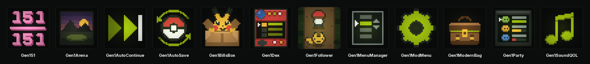</a>
</p>

## What is in the index

Two ways in. The bundles are the whole suite in one card each; everything in
them is also listed separately, for anyone who wants three of these and not
thirteen.

| | Bundle | What it is |
|---|---|---|
| 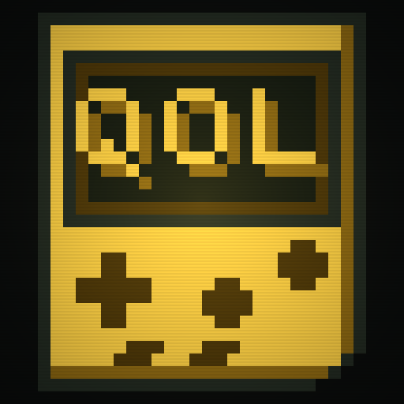 | **[Gen1WildQOL](https://github.com/wild1walker/Gen1WildQOL)** | The quality-of-life half in one mod: sprinting, autosave, auto continue, sound, followers, all 151, EXP share, menu layout, the mod manager and four later-generation conveniences. Every feature switches on and off by itself. |
| 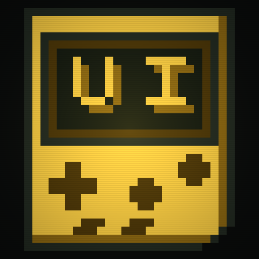 | **[Gen1WildUI](https://github.com/wild1walker/Gen1WildUI)** | The visual half in one mod: battle backdrops, the battle intro, the Pokédex, the box, the party menu, the bag, an icon and a description for every item on every mart, PC and bag screen, the lift panel, menu layout and the mod manager. Every feature switches on and off by itself. |

Install both and they cooperate: the two features they share are set up once,
not twice, and a mod in one can still find a mod in the other.

### Everything in them, separately

| | Mod | What it does |
|---|---|---|
| 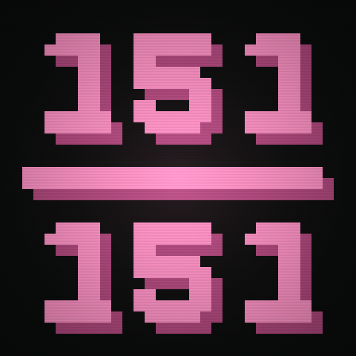 | **[Gen151](https://github.com/wild1walker/Gen151)** | All 151 obtainable renewably in one save, on one version, without trading — version exclusives, gift and fossil mons, a LINK CABLE for the trade evolutions, and every vanilla encounter left exactly as it was. |
| 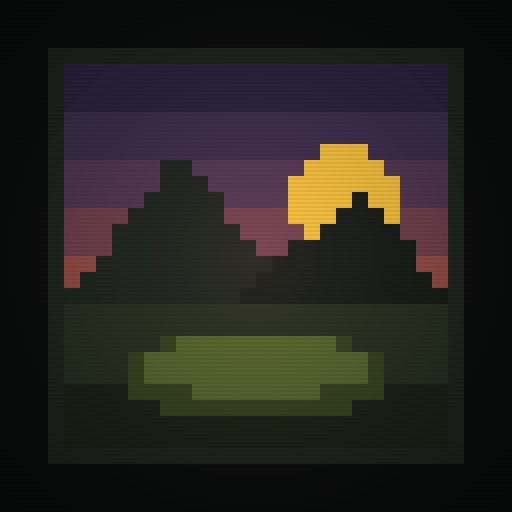 | **[Gen1Arena](https://github.com/wild1walker/Gen1Arena)** | 2D backdrops behind battles, picked by map, tileset and how the encounter started. |
|  | **[Gen1AutoContinue](https://github.com/wild1walker/Gen1AutoContinue)** | Boot to title, one press, playing. Skips the intro, the CONTINUE / NEW GAME menu and the save-info window. |
| 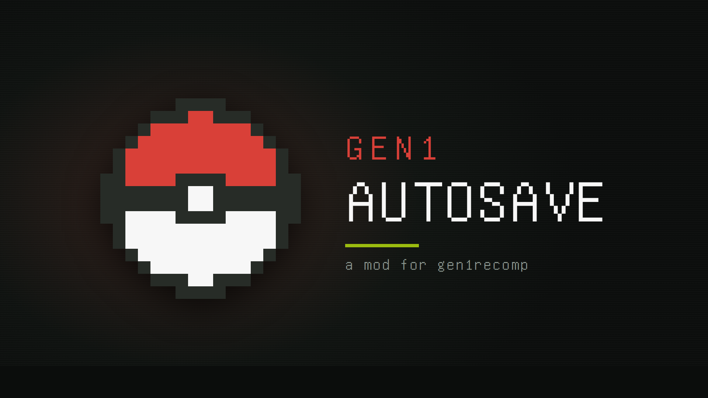 | **[Gen1AutoSave](https://github.com/wild1walker/Gen1AutoSave)** | Autosaves on a play-time timer and after battles, catches and new areas, with optional rollback backups. |
|  | **[Gen1BattleUI](https://github.com/wild1walker/Gen1BattleUI)** | The battle command and move menus as four buttons in a 2x2 grid instead of a list, drawn in the game's own text boxes. Dialogue still takes the bottom of the screen back for as long as it is talking. Both battle layouts. |
| 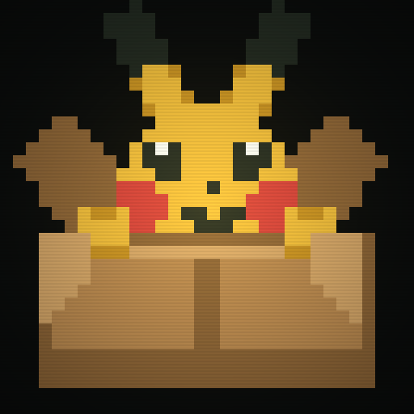 | **[Gen1BillsBox](https://github.com/wild1walker/Gen1BillsBox)** | Replaces Bill's PC with the box it was standing in for: the party down the left, twenty visible slots on the right, and a cursor that carries a Pokémon. |
| 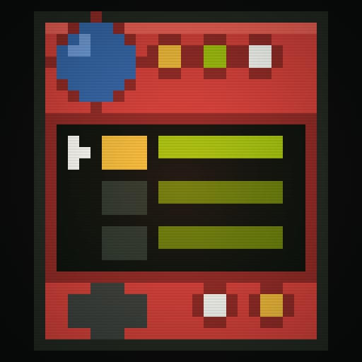 | **[Gen1Dex](https://github.com/wild1walker/Gen1Dex)** | The Pokédex with a POKéMON beside every entry: the party icon left of each row, a black silhouette until you have seen that species, base stats, evolutions and the full movelist behind it, and an AREA screen that opens on the ones you have never met and says how to get there. |
| 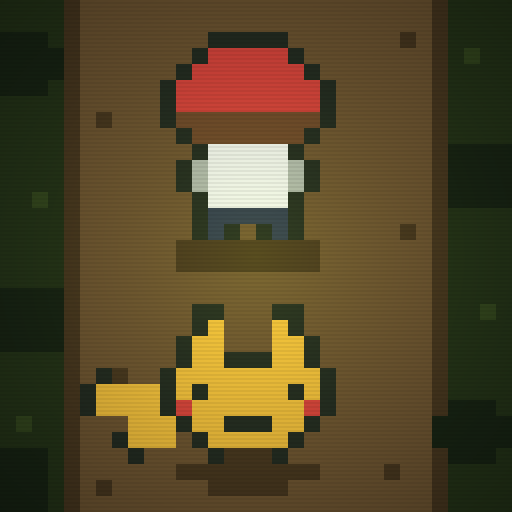 | **[Gen1Follower](https://github.com/wild1walker/Gen1Follower)** | All 251 Gen 1 and Gen 2 overworld followers, with Pokédex-proportional sizing and voxel support, and the Pokémon standing on the maps drawn from the same sheets. Built from the PokéPC Followers work by Antigravity & gamecorner33. |
| 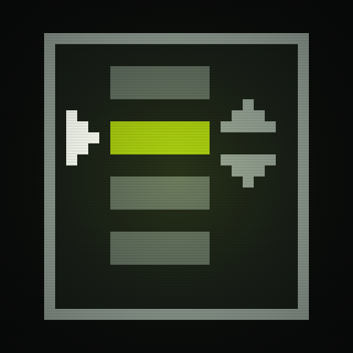 | **[Gen1MenuManager](https://github.com/wild1walker/Gen1MenuManager)** | Rearrange the START menu and the Pokémon Center PC menu: reorder rows, hide the ones you never touch, and pin field items and moves to rows of their own. |
| 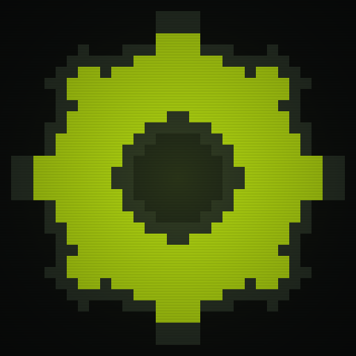 | **[Gen1ModMenu](https://github.com/wild1walker/Gen1ModMenu)** | The mod manager, redrawn in the game's own OPTION-screen idiom: framed cards with the name on its own line and its value below, plus sorting, filters and a RESET DEFAULTS row on every mod's options page. |
| 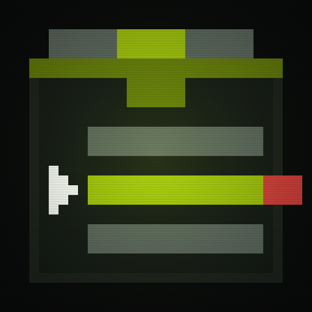 | **[Gen1ModernBag](https://github.com/wild1walker/Gen1ModernBag)** | Seven inventory pockets with an icon on every row, auto-sorting, Favorites, pinned items, quick search, TM/HM tools and no capacity limit. Derived from FAFF0x's Modern Bag. |
| 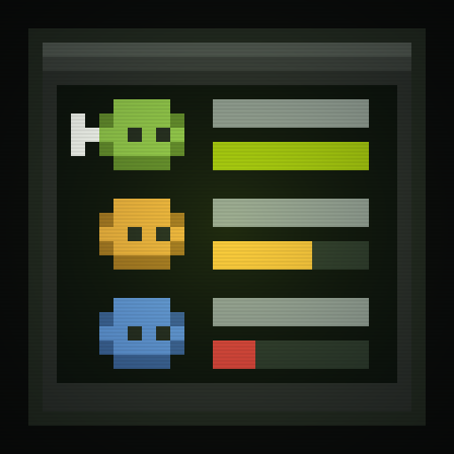 | **[Gen1Party](https://github.com/wild1walker/Gen1Party)** | The party menu with every POKéMON in its own species colours instead of all six sharing one, and the status and HP numbers pulled in off the screen edge. |
|  | **[Gen1SoundQOL](https://github.com/wild1walker/Gen1SoundQOL)** | The low-HP battle siren beeps once instead of looping forever, and on mobile the game mutes itself when another app takes the audio. |
| 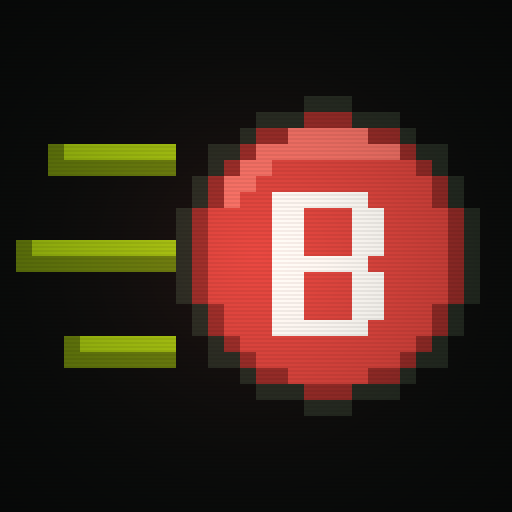 | **[Gen1Sprint](https://github.com/wild1walker/Gen1Sprint)** | Hold B to run at FireRed's running-shoes speed, and a BICYCLE that stays worth riding at twice the speed Gen 1 gives it. |

### On its own

Not in either bundle — a mod the suite does not carry, listed here because the
index is where I put the mods I maintain.

| | Mod | What it does |
|---|---|---|
| 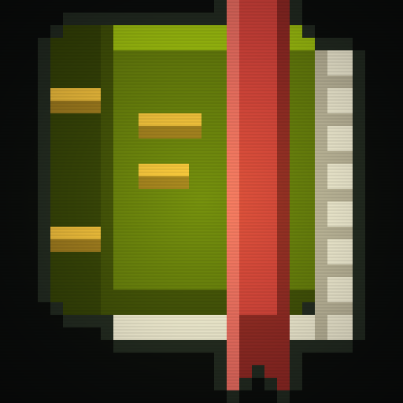 | **[Gen1Remember](https://github.com/wild1walker/Gen1Remember)** | A POKéMON can be taught a move it has forgotten. A REMEMBER row in the popup you already open on it — the party menu's, and Gen1BillsBox's box — listing every level-up move it should have had by the level it has reached, its pre-evolutions' included. |

Every icon above is the one the card carries in **FIND MODS**, drawn by
[`tools/make_icons.py`](tools/make_icons.py). No mod is vendored here: each
entry points at a release in that mod's own repo.

The two bundles are pinned above the alphabetical run, in the feed and on the
page both, by `"featured": true` in their `meta.json`. It is for the bundles
and not a general-purpose highlight: a feed where everything is featured is a
feed where nothing is.

## Adding it in the game

**MODS > FIND MODS**, add the index

```
wild1walker/Gen1Wild
```

The repo page URL, the Pages root and the feed URL itself all resolve to the
same source, so any of them works in that box.

Adding an index is a deliberate act of trusting whoever publishes it. A
listing buys a mod no trust it would not otherwise have: installing from a
card runs the same import an **Import mod .zip** does, and the installer still
refuses an archive whose manifest id is not the one being installed.

## When a mod here is also in the community index

- **Duplicate ids.** Both feeds are cached separately and merged in the UI
  layer, so which entry wins is worth eyeballing in **FIND MODS** rather than
  reasoning about. A higher `version` generally helps.
- **Cache ordering.** Mod-sync resolves entries from *cached* index data before
  it runs its "add index source" step, so a device that has never opened
  **FIND MODS** since the feed was added reports the mod missing on its first
  sync. Add the feed and open **FIND MODS** once on each device before sharing
  a mod list.

## Whose mods are in here

Ones I maintain -- which is not the same as ones I wrote. Some started here.
Others are someone else's mod that I took and tweaked until it did what I
wanted, and those keep the original authors' credit and their own licence:

- **Gen1Follower** is built from Antigravity and gamecorner33's
  [PokéPC Followers](https://github.com/mfrtechconsult/PokePCFollowers), and its
  Gen II sprite sheets descend from ShockSlayer and the Pokémon Crystal Clear
  team's work by way of the PokéPC / Followers EX lineage.
- **Gen1ModernBag** is a derivative of **FAFF0x**'s Modern Bag, taken at
  upstream 1.6.0. Nearly all of what it does is FAFF0x's work; its MIT notice
  is carried verbatim.
- **Gen1ModernBag**'s and **Gen1WildUI**'s item icons are
  [Pokémon Polished Crystal](https://github.com/Rangi42/polishedcrystal)'s, by
  **Rangi** (Rangi42) and that project's graphics contributors, recolored from
  its own palette data and scaled to sixteen pixels. None of that art was drawn
  for these mods. Polished Crystal ships no licence file; what its credits ask
  for is credit by name, a word upstream before a wide release, and that a
  request to drop an asset is honoured. Each mod's own `CREDITS.md` carries the
  full attribution and travels with the assets.
- **Gen1Arena**'s backdrops are the **Battle Backgrounds Patch FR** — LibertyTwins,
  princess-phoenix, carchagui, aveontrainer, WesleyFG, kWharever, worldslayer608
  and knizz. None of that art was drawn for this mod, and its authors ask that
  the names travel with it.
- **Gen151** is a second take on
  [All Pokémon Catchable 151](https://github.com/wowabox/All_Pokemon_Catchable_151_Mod)
  by **Wowabox (Darklinkduck)**, which got to completing the Kanto dex in one
  save without trading first. None of its code is here and the two are
  alternatives rather than a fork, but the idea is Wowabox's.

Where a mod started as someone else's, or leans on their art, its own README
says so and names who it belongs to. Every mod here also stands on
[pret](https://github.com/pret)'s disassemblies and on
[Gen1Recomp](https://github.com/bryanthaboi/gen1recomp), which are likewise
other people's work.

If you are one of the people named above and want your work credited
differently, or not carried here at all, that request is honoured.

What this index does not take is listings for mods I have nothing to do with.
Adding an index is an act of trust, and this one is only worth trusting
because the list stays short enough that I can vouch for every line in it --
which I can only do for something I maintain. A wider list is what the
community index is for.

Contributions are the opposite of unwelcome: issues, fixes, art,
translations, ideas. They belong in the mod's own repo, behind the **source**
link on its card, and I would rather have them than not.

## What is in here

Metadata, and nothing else. No mod is vendored: every entry points at a
release in that mod's own repo.

```
mods/<Author>@<mod id>/
  meta.json        required
  description.md   optional — the long form the card links to
  thumbnail.png    optional — a square icon; tools/make_icons.py draws them
site/data/index.json   generated; this is the feed
```

## Adding one of mine

Make the folder, write `meta.json`, push. The rest happens on its own. It is
written down because I forget, not because the index is open -- but it is also
the shape to match if you are working on one of my mods and the entry needs to
change with it.

```jsonc
{
  "id": "your_mod",              // must equal the mod's manifest.json id
  "title": "Your Mod",
  "author": "Wild",
  "summary": "One line for the card.",
  "version": "1.0.0",
  "categories": ["GAMEPLAY"],    // GAMEPLAY CONTENT BALANCE ART AUDIO UI QOL
                                 // TRANSLATION TOTAL_CONVERSION LIBRARY TOOL OTHER
  "tags": ["something", "else"],
  "repo": "https://github.com/wild1walker/YourMod",
  "github": "wild1walker/YourMod",
  "api": 2,
  "game_version": ">=0.0.0-dev <1.0.0",
  "profile": "content",
  "license": "MIT"
}
```

`id`, `title`, `author`, `version`, `categories` and `repo` are required; the
build fails and names anything missing.

Three rules the installer enforces, so an entry is worth checking against them
before it goes in:

- `id` must match the `id` in the served zip's `manifest.json`, or the
  installer refuses the download. Keep a fork's id identical to upstream's --
  the engine keys enable state, per-version options and mod-sync entries by id.
- The zip must be **flat**, with `manifest.json` at the root. A GitHub source
  archive (`/archive/refs/tags/...`) will not work: it nests everything under a
  top-level directory. `modkit.py add-release-workflow` produces the right
  shape.
- Ids must be unique within this feed.

**Versions look after themselves.** With `github` set, a rebuild reads that
repo's Releases, takes the newest one with a `.zip` asset, and puts it on the
card — so tag a release in the mod's own repo and this index catches up without
being touched. The `version` in `meta.json` is only the fallback shown when no
release can be resolved — and the rebuild keeps that in step too, writing the
resolved version back into the entry rather than leaving a number there that
is right only until the next release. Which is the point: a fallback nobody
looks at is a fallback that has quietly gone stale by the time it is needed.
An entry that resolves no release keeps whatever version it was given by hand.

Opt out with `"automatic_version_check": false` and give the entry its own
`"downloadURL"` pointing at an installable `.zip`.

## The wordmark

The wordmark at the top of this file is hand-made, and it is the whole
family's -- every mod repo carries the same file at `docs/banner.png` and
leads with it, under its own name. One mark, thirteen repos: a reader who has
seen one of these mods recognises the next one on sight, which is the entire
job a mark has.

It is committed as artwork, so there is no tool that redraws it. Replacing it
means replacing that one PNG in each repo.

The Pages site leads with it as well, and is served the same bytes rather than
a copy: only `site/` is uploaded, so `.github/workflows/pages.yml` stages
`docs/banner.png` into the artifact at deploy time. That keeps one PNG per
repo true here too. `site/banner.png` is gitignored, so copying it across to
preview the page locally is safe; without it the page falls back to a plain
text heading rather than losing its title.

The tab icon is cut from the same file, so it cannot drift from the mark:

```sh
python3 tools/make_favicon.py
```

It lifts the wordmark's leading G onto the mark's own blue and writes
`site/favicon.png` and `site/favicon-32.png`. Re-run it after replacing the
wordmark.

The strip of icons under it is generated, from the mods' own thumbnails:

```sh
python3 tools/make_lineup.py
```

It writes `site/banners/lineup.png` -- every mod, the strip above -- and one
`lineup-<Mod>.png` per mod, which is that mod ringed alongside five others,
under a **Check out my other mods!** line. Each mod repo carries its own as
`docs/lineup.png` and links it, and its wordmark, back to the live index, so
a reader who lands on any one mod can see where the page they are on sits in
the family.

**Five others, not all of them.** Every mod on every mod's page grew with the
index and stopped being read: a dozen icons over a dozen names is a wall, and
the mod you are already looking at is lost in the middle of it. Six tiles is a
glance. Which five a mod gets is arbitrary but fixed -- each candidate is
ordered by a hash of its name paired with the name of the mod whose strip it
is -- so every mod gets its own five, the same five on every machine, and a
rebuild that changed nothing rewrites nothing. Adding a mod reshuffles all of
them, which is how a new one turns up on the others' pages without being put
there by hand.

The full strip is still the link preview: `site/index.html` points `og:image`
at `lineup.png`, so pasting the index URL into a chat unfurls as every mod and
its name rather than a bare link.

Both need `Pillow`, and fetch the label font from Google Fonts once into
`tools/.cache/`, which is not committed.

A new mod is picked up automatically: it needs a `meta.json` and a
`thumbnail.png` like any other entry, and the next run draws it into the full
strip and reshuffles which mods share the per-mod ones.

## The icons

Every entry's `thumbnail.png` is a square 512x512 icon drawn by

```sh
python3 tools/make_icons.py            # redraw every icon
python3 tools/make_icons.py gen1arena  # ... or just the ones named
```

Each one is pixel art on a 32x32 grid scaled 16x with no resampling, so a
drawn pixel stays a hard-edged block, and nothing is read off disk -- no font,
no source image -- so any machine redraws the same bytes. A new mod gets an
icon by adding a draw function to that file and listing it in `ICONS` against
the mod's `id` -- an entry's folder carries its author and an author can
change, an id cannot. Run without arguments the script names any folder it has
no icon for and exits non-zero, so an entry cannot quietly go without one.

## Rebuilding the feed

```sh
python3 tools/build_index.py                    # rebuild
GITHUB_TOKEN=... python3 tools/build_index.py   # ... without the 60/hour limit
```

CI does it on every push that touches `mods/` or `tools/`, hourly at :17, and
on demand from the Actions tab. A rebuild that changes nothing keeps the
previous `generated_at` and commits nothing, so a quiet hour stays quiet.

Hourly, not nightly, because nightly is the wrong trade for a feed whose whole
job is to be current: Gen1ModernBag tagged 1.1.0 at 22:32 and the feed still
described 1.0.0, with nothing due to run until 05:17. An hour's worst case
costs about fifteen seconds of CI and needs no credential anywhere.

And not faster than hourly, because nothing downstream can use it — see below.

## What this feed is not

It is worth being clear about, because it is easy to assume otherwise: **this
feed is not how an installed mod learns it is out of date.**

The feed is what **MODS > FIND MODS** lists — browsing, and the version shown
before you install something. Once a mod *is* installed, the game checks that
mod's own repository directly, on its own six-hour cache, and never reads this
file (`src/mods/ModUpdate.lua`, `CACHE_TTL`). What decides whether an installed
mod gets checked at all is the `github` field in **its own `manifest.json`** —
a mod without one is skipped outright, however current this index is.

So the two halves are independent:

| | Driven by | Freshness |
|---|---|---|
| A card in FIND MODS | this feed | up to an hour |
| An installed mod's update badge | that mod's `manifest.json` `github` | up to six hours |

Which is also why rebuilding this feed every few minutes would buy nothing: it
would be answering a question nothing is asking.

## Where it is served from

The launcher tries the Pages URL first and falls back to the raw file on
`main`:

```
https://wild1walker.github.io/Gen1Wild/data/index.json   (Pages)
https://raw.githubusercontent.com/wild1walker/Gen1Wild/main/site/data/index.json
```

`.github/workflows/pages.yml` publishes `site/` to Pages, and Pages is on, so
the first URL answers. Turning it on was a one-time manual step —
**Settings > Pages > Build and deployment > Source: GitHub Actions** — because
creating a Pages site needs admin rights on the repository and the Actions
token does not have them; the workflow keeps it up to date from here on
without being touched.

It has to be the **GitHub Actions** source rather than a branch: branch
publishing only offers the repo root or `/docs`, and the feed lives in
`site/`. What is served is whatever the job uploads, so `site/index.html`
becomes the page at the root.

It deploys after **Build index** as well as on a push, because that job
commits a regenerated feed and the deploy has to follow it rather than race
it. The fallback stays a fallback: if Pages is ever off or mid-deploy, the raw
file on `main` still answers.

This repo was `wild1walker/gen1wild-mod-index` before it was renamed, and an
index anyone already added is stored as whatever they typed. The old slug keeps
working: GitHub redirects the repo, and `raw.githubusercontent.com` serves the
old path unchanged, so the fallback URL still answers. The Pages URL is the one
that moves with a rename — the old one stops answering, so a launcher holding
the old slug quietly lands on the mirror every time instead of the CDN.
Re-adding the index as `wild1walker/Gen1Wild` puts it back on Pages.

## How this is written

Worth saying plainly, because it changes how much weight to give any of it:
none of this comes from expertise. The code here, and in the mods this index
lists, is either borrowed from other people's work or vibe coded — generated,
then baby-sat by me through a long run of trial and error until it did what it
was supposed to. What is actually mine is the testing, the fixing, and the
call on what ships.

Two things follow. Credit for the borrowed parts stays with whoever earned it,
named in the description of the mod that uses it. And a bug report is worth
more here than on a project with someone's expertise behind it — trial and
error is how everything else got found, so if something breaks, tell me.

## Licence

The index metadata is CC0 — take it. Each mod is licensed by its own author.
